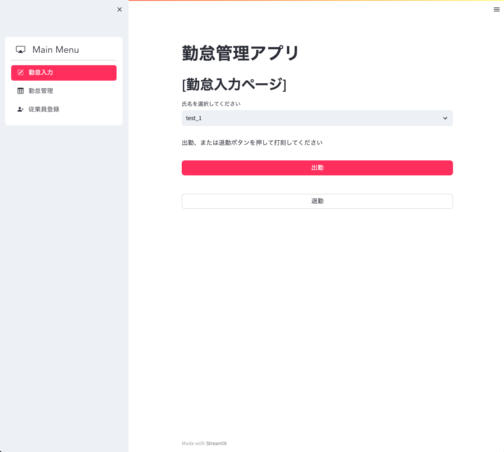
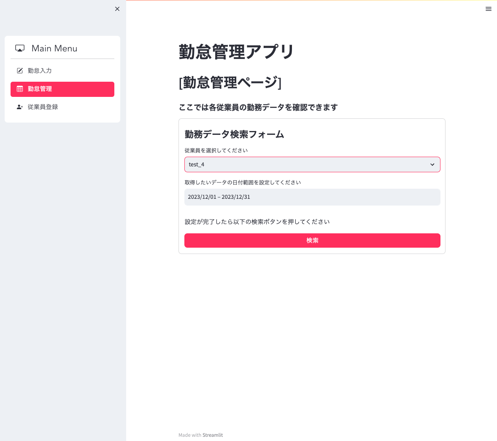
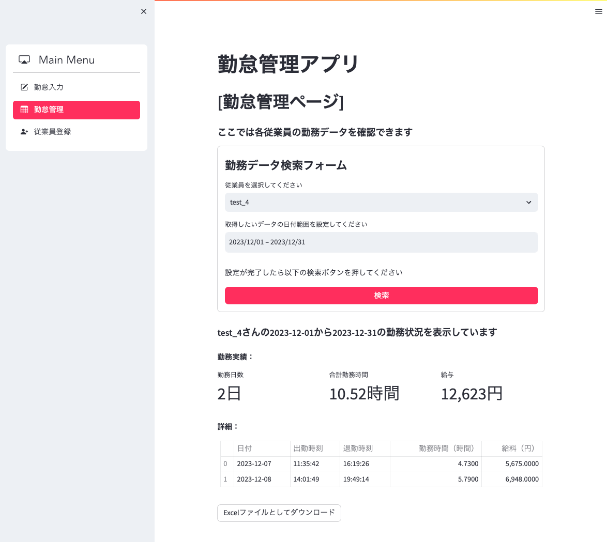
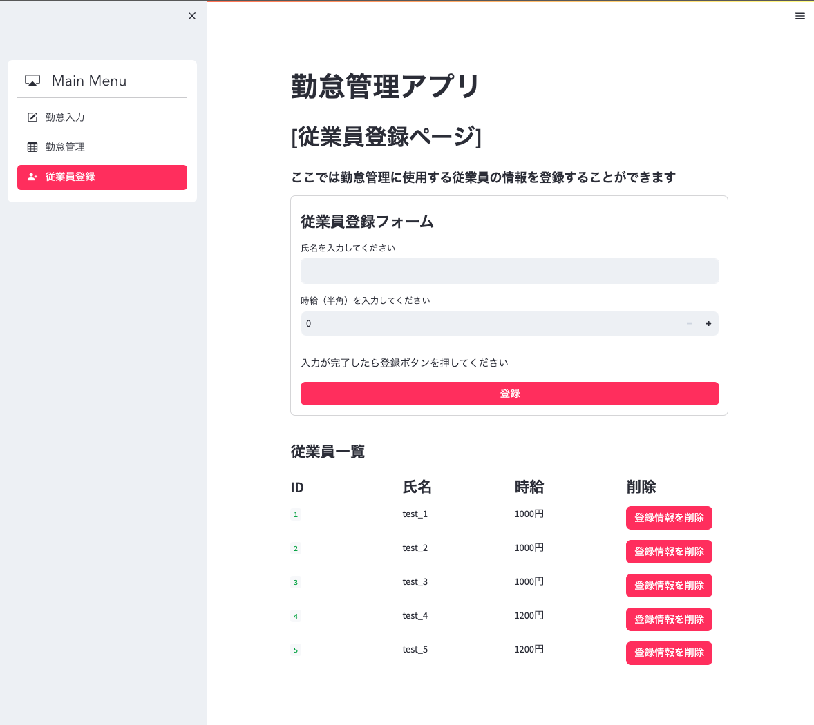

# 概要
従業員の出退勤を管理する勤怠管理アプリです。  

### ▼ サイトURL  
https://attendance-management-efpv.onrender.com  

### ▼ サイトイメージ
| 勤怠入力画面 |　勤怠管理画面（検索フォーム） |
| ---- | ---- |
|  |  |
| 各従業員の出退勤時刻を記録する打刻機能を実装しました | 各従業員の勤務データを日付で絞り込み検索できる機能を実装しました |

| 勤怠管理画面（検索結果表示） |　従業員登録画面 |
| ---- | ---- |
|  |  |
| 各従業員の勤務データを表形式で表示する機能を実装しました | 勤怠管理に用いる各従業員のデータを登録する機能を実装しました |

# 企画書
## 背景
自分が働いているアルバイト先では勤怠管理をタイムカードで管理しており、勤怠管理の作業にかなりの時間を要していたのでそれを解決できないかと思いました。  

今回のアプリの想定ユーザーは店長と従業員です。  

### 現状
- 従業員は出勤時刻などの打刻はタイムカードで行っている
- 店長が月末にタイムカードの記載された時刻をエクセルに入力し、そのデータを本社に送信
- 残業などの勤務時間の管理はタイムカードに記載された時刻をもとに計算して把握している  

## 課題  
① ユーザー（店長）は各従業員のタイムカードの時刻を一つ一つエクセルに手入力しなければならず、入力ミスが発生しやすい  

② ユーザー（店長）は手入力で入力するために作業に時間がかかっている  

③ ユーザー（店長）はタイムカードが各従業員分あるので管理が大変  

④ ユーザー（店長）はエクセルに入力した時刻データから勤務時間と給与計算をしなければならず、作業に時間がかかっている  

⑤ ユーザー（店長）は従業員の労働時間を管理するために日々の勤務時間をタイムカードから手計算で把握する必要があり、把握しづらくなっている  

⑥ ユーザー（従業員）はパートの方も多く、パソコン操作などに慣れていない方が多いので複雑な作業はなるべく避けたい  

⑦タイムカードは誤った時間に打刻すると修正ができない

## 解決方法 / 機能一覧  
ここでは先ほど挙げた課題を解決するためにアプリに必要な機能を記載していきます。  

| 機能No. |　機能名称 | 機能優先度 | 実装予定 | 対象課題 |
| ---- | ---- | ---- | ---- | ---- |
| 1 | 打刻機能 | 高 | あり | ①②⑥ |
| 2 | ユーザー登録機能 | 高 | あり | ⑥ |
| 3 | 勤務データ検索機能 | 高 | あり | ③ |
| 4 | 勤務データ集計機能 | 高 | あり | ④⑤ |
| 5 | 勤務データエクセルファイル化機能 | 中 | あり | ②④⑤|
| 6 | 勤務データ修正機能 | 中 | なし | ⑦ |
| 7 | 残業発生表示機能 | 低 | なし | ⑤ |

### 各機能の詳細
**打刻機能：**
- 出勤・退勤ボタンを押すだけで出勤時刻と退勤時刻を打刻することができるようにする。そうすることでユーザー（従業員）は簡単な操作で打刻することが可能になる。
- 打刻によって自動的にDBに時刻が保存されるようになり、ユーザー（店長）はエクセルの手入力をする必要がなくなる 。 

**ユーザー登録機能：**
- 各従業員の名前や時給などのデータを登録する。
- この機能によってユーザー（従業員）ごとにデータを管理することが可能になるので、店長は各従業員のデータをアプリ内で一元管理できるようになる。
- また、従業員も出退勤時にユーザー選択と出退勤ボタンを押すだけなのでアプリの操作数を最小限にできる。  

**勤務データ検索機能：**
- 特定の従業員、日付範囲のデータを取得することができる。 
- 検索機能をつけることで、見たいデータを一発で取得できるようにする。  

**勤務データ集計機能：**
- 出退勤時刻から勤務時間や給料を計算し、それを表形式で表示する。
- アプリ上で計算することでエクセル上での勤務時間や給与計算の作業をなくす。

**勤務データのエクセルファイル化機能：**
- 表形式で表示する勤務データをエクセルファイルとしてダウンロードすることができるようにする。
- この機能があることで、エクセルを操作せずにエクセルファイルを作成して直接本社に勤務データを提出することができるようになる.。  

**勤務データ修正機能：**
- 記録された出退勤時刻を編集することができる。
- 誤って打刻された場合でも修正が可能となり、正しくデータで管理できるようになる。

**残業時間表示機能：**
- 時間外労働が発生すれば、表形式の勤務データの行が赤色に表示されるようにする。
- この機能により、ユーザー（店長）は手計算せずとも視覚的に残業している従業員を把握することができるようになる。

## 使用技術一覧
**バックエンド:** Python 3.9.8 / FastAPI 0.104.1  

**フロントエンド:** Python 3.9.8 / Streamlit 1.29.0  

**インフラ:** Render.com  

**データベース:** SQLite  

**環境構築:** Poetry  